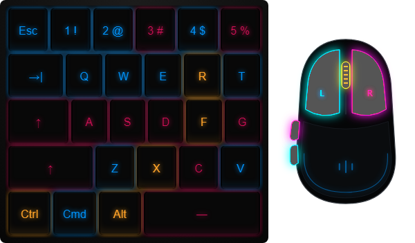
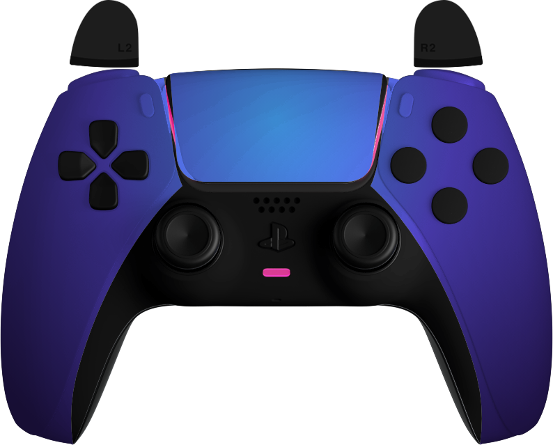

<div align="center">

# 🎮 Game Overlay

**Покажи каждое нажатие. Настрой под себя. Возвращайся в игру.**

Прозрачный оверлей клавиатуры, мыши и геймпада для Windows.


[**⬇ Скачать готовую программу**](https://github.com/sup4ek/Game-Overlay/releases/latest)

[Установка](#-установка) · [Возможности](#-возможности) · [Управление](#-управление) · [Вопросы](#-частые-вопросы)

</div>

> [!NOTE]
> **Windows может показать предупреждение при запуске.**
> EXE в релизе не подписан цифровым сертификатом издателя. Microsoft Defender
> SmartScreen может показывать «Система Windows защитила ваш компьютер»
> для незнакомых приложений без накопленной репутации. Само такое предупреждение
> не означает, что обнаружен вирус. [Как это объясняет Microsoft](https://learn.microsoft.com/en-us/windows/apps/package-and-deploy/smartscreen-reputation).
>
> **Что можно проверить у Game Overlay:** исходный код открыт в этом репозитории;
> обработчик клавиатуры и мыши передаёт события локально для подсветки нажатий.
> Архивы релиза проверены на совпадение с файлами готовой сборки, а их SHA-256
> опубликованы в `SHA256SUMS.txt`. Скачивайте программу из [Releases этого проекта](https://github.com/sup4ek/Game-Overlay/releases/latest).
>
> Это не гарантия отсутствия уязвимостей: совпадение хеша подтверждает целостность,
> а не безопасность файла. Если Defender сообщает **название конкретной угрозы**,
> не отключайте защиту — отправьте название обнаружения и версию приложения
> в [Issues](https://github.com/sup4ek/Game-Overlay/issues), чтобы проверить срабатывание.

<div align="center">



*Keyboard + Mouse · Summer · пример подсветки нажатий*



*DualSense · Rich Indigo*

</div>

---

## ✨ О проекте

**Game Overlay** отображает нажатия поверх других окон: клавиши подсвечиваются,
мышь показывает нажатые кнопки, а геймпад — состояние кнопок и стиков.
Выберите устройство, оформление и размер, разместите оверлей в удобном месте —
приложение запомнит настройки до следующего запуска.

Оверлей пригодится для демонстрации управления, записи обучающих роликов
и проверки нажатий. В обычном режиме он пропускает клики в приложение под ним.

## 🧩 Возможности

| Устройство | Что отображается | Оформление |
| --- | --- | --- |
| **Keyboard** | Компактная клавиатура на 27 клавиш | 6 скинов |
| **Keyboard + Mouse** | Клавиатура и мышь с пятью кнопками | Те же 6 общих скинов |
| **DualSense** | Кнопки и стики геймпада | 15 скинов |
| **Xbox** | Кнопки и стики геймпада | 14 скинов |

- **Размер в реальном времени.** Ширина и высота меняются при вводе допустимого числа, без Enter.
- **Быстрое перемещение.** Нажмите «Перетащить», разместите устройство и закрепите его клавишей Enter.
- **Сохранение настроек.** Положение, размеры форм-факторов, скины и последние выбранные варианты устройств восстанавливаются после запуска.
- **Смена скина без сброса нажатий.** Удерживаемые кнопки сохраняют подсветку при переключении оформления.
- **Управление из трея.** Настройки и выход доступны через значок приложения.
- **Переподключение в один клик.** Кнопка обновления в шапке перезапускает обработку клавиатуры и мыши или загрузку геймпада.
- **Один экземпляр.** Повторный запуск открывает настройки уже работающего приложения.

## 📦 Установка

**Скачайте, распакуйте и запустите. Node.js, npm и Git не нужны.**

1. Откройте [**последний релиз**](https://github.com/sup4ek/Game-Overlay/releases/latest).
2. В разделе **Assets** скачайте один из архивов:

   | Архив | Чем распаковать |
   | --- | --- |
   | [**Game-Overlay-1.0.1-win-x64.7z**](https://github.com/sup4ek/Game-Overlay/releases/download/v1.0.1/Game-Overlay-1.0.1-win-x64.7z) | 7-Zip |
   | [**Game-Overlay-1.0.1-win-x64.rar**](https://github.com/sup4ek/Game-Overlay/releases/download/v1.0.1/Game-Overlay-1.0.1-win-x64.rar) | WinRAR |

3. Распакуйте **всю папку `Game Overlay`** в удобное место.
4. Откройте её и запустите **`Game Overlay.exe`**.

Оба архива содержат одну и ту же готовую программу для **Windows x64**.
Выберите удобный формат — скачивать оба не требуется.

> **Важно:** запускайте EXE из распакованной папки. Файлы DLL и каталоги
> `resources` и `locales` должны оставаться рядом с ним.

Меню настроек откроется автоматически. Для отображения геймпадов нужен интернет.

**Source code (zip / tar.gz)** на странице релиза и **Code → Download ZIP**
содержат исходники. Для обычного запуска выбирайте архив **Game-Overlay-…** из таблицы выше.

### Обновление

Завершите приложение через **«Выход»** в трее или настройках, скачайте новый
архив и распакуйте его в отдельную папку. Запускайте EXE из новой папки.
Настройки хранятся в профиле пользователя отдельно от файлов программы.

## 🚀 Первый запуск

1. Выберите **Клавиатура** или **Геймпад**.
2. Укажите форм-фактор и скин.
3. Введите ширину и высоту — результат виден сразу.
4. Нажмите **«Перетащить»**, переместите оверлей и нажмите **Enter**.
5. Закройте настройки крестиком или сочетанием **Ctrl + Alt + M**.

Для геймпада подключите контроллер и нажмите любую кнопку, чтобы страница
Gamepad Viewer могла его обнаружить.

## ⌨️ Управление

| Действие | Как выполнить |
| --- | --- |
| Открыть / закрыть настройки | **Ctrl + Alt + M** |
| Закрыть открытое меню | **Escape** или крестик |
| Изменить размер | Ввести допустимые ширину и высоту |
| Переместить оверлей | **«Перетащить»** → перемещение мышью |
| Закрепить положение | **Enter** в режиме перемещения |
| Переподключить устройство | Значок обновления рядом с крестиком |
| Открыть настройки из трея | Клик по значку приложения |
| Открыть меню трея | Правый клик по значку |
| Завершить приложение | **«Выход»** в настройках или трее |

Во время перемещения сначала нажмите Enter: до закрепления Ctrl + Alt + M
не открывает настройки. Закрытие меню оставляет оверлей работать.

## 💡 Несколько советов

- Начните со стандартного размера и подберите положение, где устройство не перекрывает важные элементы игры.
- Используйте монохромный скин для спокойного оформления, а Summer — когда нужно выделить нажатия.
- Ширина и высота геймпада масштабируются независимо: меняя только одну сторону, вы меняете пропорции рисунка.
- После отключения монитора приложение возвращает оверлей в видимую область экрана.

## ❓ Частые вопросы

<details>
<summary><strong>Геймпад не появился. Что проверить?</strong></summary>

Убедитесь, что контроллер подключён, нажмите на нём кнопку и проверьте интернет.
Затем нажмите значок переподключения в шапке настроек. Текущая реализация
использует внешнюю страницу Gamepad Viewer и ресурсы оформления.

</details>

<details>
<summary><strong>Клавиша или кнопка мыши осталась подсвеченной?</strong></summary>

Выберите клавиатуру и нажмите переподключение. Оно перезапускает обработчик
клавиатуры и мыши и сбрасывает текущую подсветку. Следующее нажатие отобразится заново.

</details>

<details>
<summary><strong>Почему размер не меняется, пока я набираю число?</strong></summary>

Применяются только допустимые целые значения. Пустое поле, слишком маленькое
или слишком большое число не меняет текущий размер. Максимум ограничен рабочей
областью монитора; минимум зависит от форм-фактора.

</details>

<details>
<summary><strong>Будет ли оверлей работать в эксклюзивном fullscreen?</strong></summary>

Поддержка эксклюзивного полноэкранного режима пока не реализована.
Для проверки используйте оконный режим или окно без рамок.

</details>

<details>
<summary><strong>Какие действия мыши отображаются?</strong></summary>

ЛКМ, ПКМ, нажатие колеса и две боковые кнопки: Mouse4 и Mouse5.
Движение курсора и вращение колеса не визуализируются.

</details>

## 🛠️ Для разработчиков

Этот раздел нужен только для изменения кода и самостоятельной сборки.
Для использования приложения достаточно архива из [Releases](https://github.com/sup4ek/Game-Overlay/releases/latest).

Стек: **Electron · JavaScript · HTML/CSS · PowerShell / C# / WinAPI**.

<details>
<summary><strong>Исходники, запуск и сборка через Node.js</strong></summary>

Нужны Node.js с npm и Git. В PowerShell:

```powershell
git clone https://github.com/sup4ek/Game-Overlay.git
cd "Game-Overlay/Game Overlay"
npm.cmd ci
npm.cmd start
```

Самостоятельная сборка:

```powershell
npm.cmd run dist
```

Результат — `dist/Keyboard Overlay.exe` в каталоге приложения.
У этой сборки пока сохраняется первоначальное имя EXE.

```text
Game-Overlay/
├── Game Overlay/        # Приложение и настройки сборки
│   ├── assets/          # Иконка Windows
│   ├── main.js          # Окна, трей, IPC и управление вводом
│   ├── renderer.js      # Отображение клавиатуры и мыши
│   ├── settings.*       # Меню настроек
│   ├── gamepad-*.js     # Скины и масштабирование геймпадов
│   └── keyboard-hook.ps1
├── checks/              # Автоматические проверки
└── docs/images/         # Иллюстрации README
```

Из каталога приложения:

```powershell
npm.cmd test
```

Набор включает **22 теста логики**: настройки, сохранение, ввод, перемещение,
переподключение и трей. Проверка интерфейса запускается отдельно на Windows:

```powershell
node ../checks/run-electron-check.cjs renderer-smoke.cjs
```

Для этой проверки нужны интернет и доступная графическая сессия.
Автоматические проверки используют синтетический ввод и не заменяют проверку
физического контроллера в игре.

</details>

## 🌱 Идеи для развития

Возможные направления, **пока не реализованные**:

- Профили настроек для разных игр.
- Экспорт и импорт конфигурации.
- Локальные ресурсы геймпадов для работы без интернета.
- Редактор собственной цветовой палитры.

Есть идея или нашли ошибку? [Создайте issue](https://github.com/sup4ek/Game-Overlay/issues).
Для ошибки укажите устройство, шаги воспроизведения и ожидаемый результат;
скриншот поможет быстрее разобраться.

## 🤝 Благодарности

Отображение геймпадов основано на **Gamepad Viewer**. В проекте используются
оформление DualSense от **philipbry** и Xbox **Freeport XSX-Black от jayraydee**;
ссылки на подключаемые ресурсы приведены в
[техническом описании приложения](Game%20Overlay/README.md).

---

<div align="center">

**Game Overlay** · by [sup4ek](https://github.com/sup4ek)

*Ваши нажатия — часть игры. Сделайте их видимыми.*

</div>
